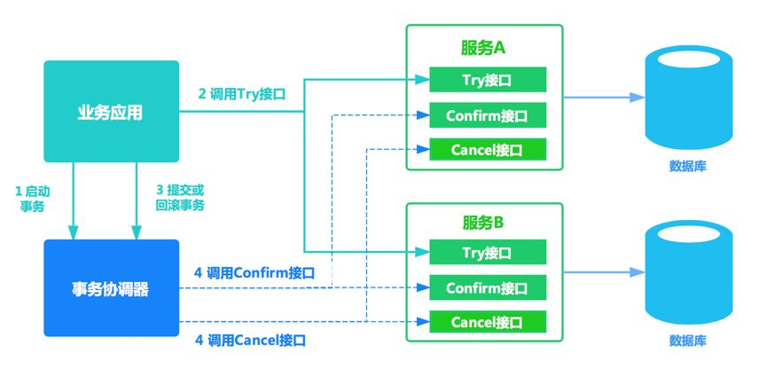

### 概念

一个请求在多个系统的调用链中如何确保数据的一致性。往往涉及到了多个数据源和多个服务

### 2PC/3PC/TCC分布式协议

#### 2PC二阶段提交协议

定义了两类节点，中心化协调节点和多个参与者节点

分为两个阶段：

##### **准备阶段：**

- 协调者向所有参与者发送事务内容，询问是否可以提交事务，并等待所有参与者答复。
- 各参与者执行事务操作，将Undo和Redo信息记入事务日志中
- 如果参与者执行成功，给协调者反馈yes，即可以提交；如果执行失败，给协调者反馈no，即不提交。

##### **提交阶段**：

（所有参与者均反馈yes）

- 协调者向所有参与者发出正式提交事务的请求
- 参与者执行commit请求，并释放整个事务期间占用的资源
- 各参与者向协调者反馈ack完成的消息
- 协调者收到所有参与者反馈的ack消息后，即完成事务提交。

（任何一个参与者反馈no）

- 协调者向所有参与者发出回滚请求
- 参与者执行回滚操作，释放事务期间占用的资源。
- 各个参与者想协调者反馈ack完成的消息
- 协调者收到所有的参与者反馈的ack消息，即完成事务中断。

##### 存在的问题

- 性能问题。执行过程中，节点都处于阻塞状态。
- 协调者单点故障问题。一旦事务协调者节点挂掉，会导致参与者收不到提交或回滚的通知，导致参与者节点始终处于事务无法完成的中间状态。
- 缺失消息导致的数据不一致问题。在第二阶段，如果发生局部网络问题，一部分事务参与者收到提交消息，一部分没有收到提交消息，那么就会导致节点间的数据不一致问题。

#### 3PC三阶段提交

2PC的改进版本，在二阶段提交的基础上增加了canCommit阶段，并引入超时机制，一旦事务参与者没有收到协调者的commit请求，就会自动进行本地commit。

**阶段1：CanCommit**
1、协调者向所有参与者发出包含事务内容的CanCommit请求，询问是否可以提交事务，并等待所有参与者答复。
2、参与者收到CanCommit请求后，如果认为可以执行事务操作，则反馈YES并进入预备状态，否则反馈NO。

**阶段2：PreCommit**
事务预提交：（所有参与者均反馈YES时）
1、协调者向所有参与者发出PreCommit请求，进入准备阶段。
2、参与者收到PreCommit请求后，执行事务操作，将Undo和Redo信息记入事务日志中（但不提交事务）。
3、各参与者向协调者反馈Ack响应或No响应，并等待最终指令。
中断事务：（任何一个参与者反馈NO，或者等待超时后协调者尚无法收到所有参与者的反馈时）
1、协调者向所有参与者发出abort请求。
2、无论收到协调者发出的abort请求，或者在等待协调者请求过程中出现超时，参与者均会中断事务。

**阶段3：do Commit**

提交事务：（所有参与者均反馈Ack响应时）

1、如果协调者处于工作状态，则向所有参与者发出do Commit请求。

2、参与者收到do Commit请求后，会正式执行事务提交，并释放整个事务期间占用的资源。

3、各参与者向协调者反馈Ack完成的消息。

4、协调者收到所有参与者反馈的Ack消息后，即完成事务提交。

中断事务：（任何一个参与者反馈NO，或者等待超时后协调者尚无法收到所有参与者的反馈时）　　

1、如果协调者处于工作状态，向所有参与者发出abort请求。　　

2、参与者使用阶段1中的Undo信息执行回滚操作，并释放整个事务期间占用的资源。　　

3、各参与者向协调者反馈Ack完成的消息。　　

4、协调者收到所有参与者反馈的Ack消息后，即完成事务中断。

#### TCC 协议

TCC 将事务的提交过程分为 try-confirm-cancel(实际上 TCC 就是 try、confirm、cancel 的简称) 三个阶段:

- try：完成业务检查、预留业务资源
- confirm：使用预留的资源执行业务操作（需要保证幂等性）
- cancel：取消执行业务操作，释放预留的资源（需要保证幂等性）

和 JTA 二阶段事务的参与方都要实现 prepare、commit、rollback 一样，TCC 的事务参与方也必须实现 try、confirm、cancel 三个接口。流程如下：

1. 事务发起方向事务协调器发起事务请求，事务协调器调用所有事务参与者的 try 方法完成资源的预留，这时候并没有真正执行业务，而是为后面具体要执行的业务预留资源，这里完成了一阶段。
2. 如果事务协调器发现有参与者的 try 方法预留资源时候发现资源不够，则调用参与方的 cancel 方法回滚预留的资源，需要注意 cancel 方法需要实现业务幂等，因为有可能调用失败（比如网络原因参与者接受到了请求，但是由于网络原因事务协调器没有接受到回执）会重试。
3. 如果事务协调器发现所有参与者的 try 方法返回都 OK，则事务协调器调用所有参与者的 confirm 方法，不做资源检查，直接进行具体的业务操作。
4. 如果协调器发现所有参与者的 confirm 方法都 OK 了，则分布式事务结束。
5. 如果协调器发现有些参与者的 confirm 方法失败了，或者由于网络原因没有收到回执，则协调器会进行重试。这里如果重试一定次数后还是失败，会怎么样？常见的是做事务补偿。

TCC 执行场景示意图如下：

### 二阶段提交 VS TCC 

- 2PC位于资源层而TCC位于服务层
- 2PC的接口有第三方厂商实现，TCC的接口由开发者实现
- TCC可以更灵活地控制资源锁定的粒度
- TCC对应用的侵入性更强，业务逻辑的每个分支都需要实现try、confirm、cancel三个操作，改造成本高